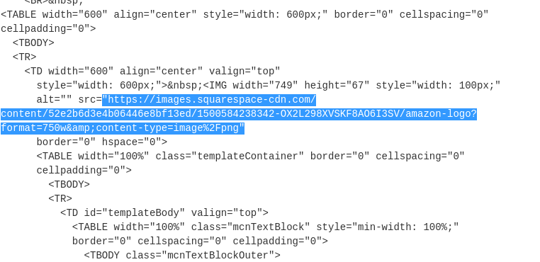

# Sample-2

Challenge: Phishing Analysis 2.&#x20;

Scenario: Put your phishing analysis skills to the test by triaging and collecting information about a recent phishing campaign.

1. Download the file&#x20;

<figure><figcaption></figcaption></figure>

2. Unzip it&#x20;

<figure><figcaption></figcaption></figure>

3. Open via any text editor you prefer (this time I'll open via Pluma) to gather the basic email info&#x20;

From: Amazn [amazon@zyevantoby.cn](mailto:amazon@zyevantoby.cn)\
To: saintington73 [saintington73@outlook.com](mailto:saintington73@outlook.com)\
Subject: Your Account has been locked\
Date: Wed, 14 Jul 2021 01:40:32 +0900\
Message-ID: [000756bf516d$9bad2034$6e61f7fb$@vinuqou](mailto:000756bf516d$9bad2034$6e61f7fb$@vinuqou)\
Content-Type: multipart/alternative\
Return-Path: amazon@zyevantoby.cn\
X-Sender-IP: 45.156.23.138

4. What company attacker is trying to imitate? Amazon. To be honest I don't know the reason behind "Amazn" typo. Something like that creates a false feeling that attackers are in general not that clever and you can underestimate them (which is wrong).&#x20;

5.  What is the URL of the main call-to-action button?\
    \
    a) Open email via Thunderbird, right-click call-to-action button which is Review Account and `Copy Link Location`.  \
    \
    Don't forget to defang it (use [CyberChef](https://cyberchef.io/)). \
    \
    hxxps\[://]emea01\[.]safelinks\[.]protection\[.]outlook\[.]com/?url=hxxps%3A%2F%2Famaozn\[.]zzyuchengzhika\[.]cn%2F%3Fmailtoken%3Dsaintington73%40outlook\[.]com\&data=04%7C01%7C%7C70072381ba6e49d1d12d08d94632811e%7C84df9e7fe9f640afb435aaaaaaaaaaaa%7C1%7C0%7C637618004988892053%7CUnknown%7CTWFpbGZsb3d8eyJWIjoiMC4wLjAwMDAiLCJQIjoiV2luMzIiLCJBTiI6Ik1haWwiLCJXVCI6Mn0%3D%7C1000\&sdata=oPvTW08ASiViZTLfMECsvwDvguT6ODYKPQZNK3203m0%3D\&reserved=0\
    \
    b) We can see that several parts of email are encoded with base64 encoding.\
    \

    <figure><figcaption>
 
</figcaption></figure>

    <figure><figcaption></figcaption></figure>

    \
    So we need to decode those parts to see what kind of information we may find there as well. We are looking for a link that is embedded into a call-to-action button. \
    \
    Let's go to CyberChef and decode what we have. You can copy the link from here as well, just don't forget to defang it.  \

    <figure><figcaption></figcaption></figure>

6. Use URL2PNG to see what we can get from this link. Not that much.&#x20;

<figure><figcaption></figcaption></figure>

7.  Encoding scheme is base64. \
    \
    A short example how this encoding works: \

    
<figure><figcaption></figcaption></figure>

8.  What is the URL used to retrieve the company's logo in the email?\
    \
    We should get back to CyberChef html code that we decoded previously and look another links related to images/logo/amazon/image formats.\
    \

    <figure><figcaption></figcaption></figure>

9.  For some unknown reason one of the URLs contains a Facebook profile URL. What is the username (not necessarily the display name) of this account, based on the URL? \
    \
    One more URL to find! Same decoded piece of content, we need to scroll just a little bit further looking for something like "url", "https", "facebook", etc. \

    <figure><figcaption></figcaption></figure>

    \
    \
    That's our facebook account url: [https://www.facebook.com/amir.boyka.7](https://www.facebook.com/amir.boyka.7)

